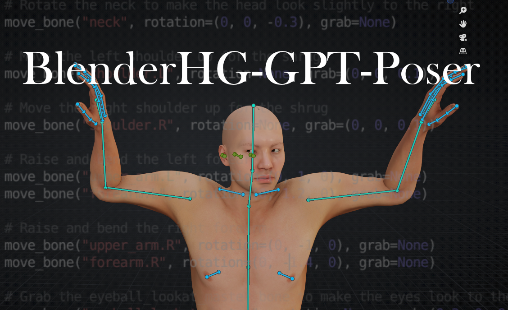

## WELCOME

Hey guys! I'm PatroKiras--- A filmmaker based in China & Canada, who's trying to pickup Blender skills to assist my works as a director. I love the HUMANGEN addon and I've been using it in my personal projects. 

One problem i noticed is that posing in Blender is no easy work, especially when you have to move and rotate many joints and bones, you get lost in the tedious process. So here I'd like to share a little fun experiment that i've been having using HumanGen and ChatGPT. It's called [BlenderHD-gpt-poser]. The goal is to use GPT text prompt to pose a human armature generated by HUMANGEN. I'm just a beginner in programing, fortunately GPT helped a lot on fixing my sytax.

After you run the script with commands generated by GPT, it will change the pose of your Amature. But it only serves as a starting point for further poses. And i have to be honest, at the current stage-----

## IT WORKS, BUT IT SUCKS!

I would imagine it requires more complex trainings that would utilize the GPT API, in which one may feed it with image reference to help it better understand the poses of human beings, at the stage that AI is developing I'm not worried at all. 

Despite the suckiness it possesses, I hope that it might interest some people much capable than I am, to make it work better, and be more competible with more RIGGING PRESETS, such as Rigify, and AutoRig Pro. 

I'll keep working on it when I have time.

## USAGE

The app is super simple. Here's how to use it (for now)
	1. Download the "BlenderHG-gpt-poser.py" & "GPT-Prompts-Guide.txt". Open them up with Text Editor.
	2. In Blender, create a Human with Human Generator addon in Blender.
	3. Select the Armature of this human, Copy and paste contents of "BlenderHG-gpt-poser.py" in your Blender Scripting Panel.
	4. Take a look at the "GPT-Prompts-Guide.txt", and paste/modify prompts to GPT. Follow the steps in the Guide but feel free to change the exact wording. 
	5. Paste the generated results at the bottom of "BlenderHG-gpt-poser" Script in Scripting Panel, and run it. I tested it with GPT4, it works fine, but it requires further interogation to produce more desiring rejsults.
